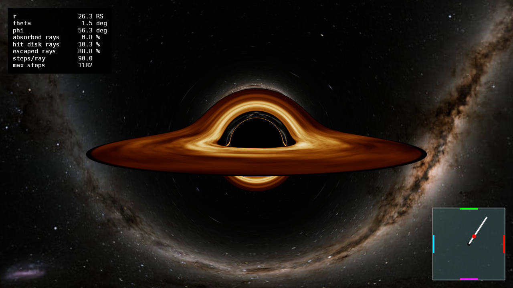
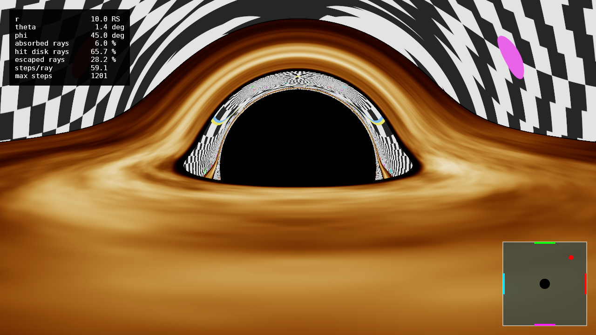
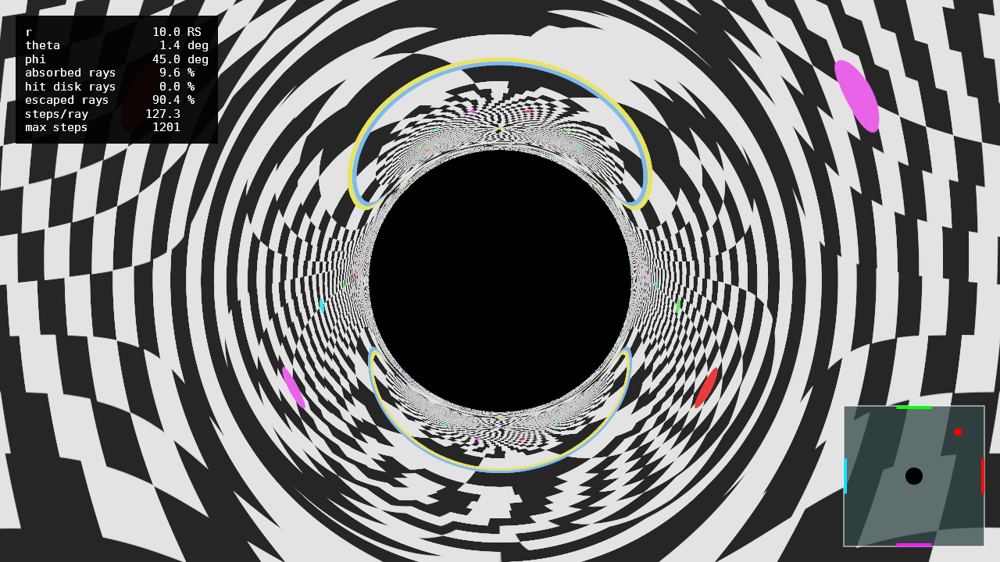

# Black Hole Ray Tracer

A GPU-accelerated renderer that solves null geodesics in the Schwarzschild spacetime and shades a relativistic accretion disk. Written in C# with [ILGPU](https://ilgpu.net/); every stage of the pipeline (ray generation, integration, shading, downsampling, tone mapping) runs as a kernel on the GPU. It produces both single images and videos along an interpolated camera path.

## What it actually computes

Light near a black hole does not travel in straight lines, so the image is built by backward ray tracing: one photon is launched from the camera through each pixel and integrated backwards in time until it either falls through the horizon, hits the accretion disk, or escapes to infinity and picks up a star from the background sky.

Everything is in geometrized units ($G = c = 1$), with the Schwarzschild radius $R_s = 1$. Distances in the configuration are therefore directly Schwarzschild radii, and the black hole mass is $M = R_s/2$.

### Reducing the problem to a plane

Schwarzschild spacetime is spherically symmetric, so every geodesic stays in a single plane through the centre. That is the key simplification of the whole tracer: instead of integrating four coupled equations in $(t, r, \theta, \phi)$, each ray is rotated into its own orbital plane and integrated as a 2D problem with two conserved quantities, the energy $E$ and the angular momentum $L$:

$$\frac{dr}{d\lambda} = p_r, \qquad \frac{d\phi}{d\lambda} = \frac{L}{r^2}, \qquad \frac{dp_r}{d\lambda} = \frac{L^2 (r - 1.5 R_s)}{r^4}$$

The sign change of the last equation at $r = 1.5 R_s = 3M$ is the photon sphere: outside it the effective potential pushes photons out, inside it pulls them in. This is what produces the black hole's shadow (radius $b = \sqrt{27} M \approx 2.6 R_s$ in impact parameter) and the thin, infinitely layered photon ring around it, where rays that orbited the hole one or more times before escaping pile up.

Because each ray lives in a different plane, the state also carries the orthonormal basis $(\mathbf{e}_1, \mathbf{e}_2)$ of that plane, fixed at generation time, so the 3D position can always be recovered:

$$\mathbf{x}(\lambda) = r \left( \cos\phi \; \mathbf{e}_1 + \sin\phi \; \mathbf{e}_2 \right)$$

Without it, a disk crossing (which happens in the global equatorial plane, not the ray's) or a skybox lookup would be impossible to detect.

### Camera and initial conditions

The camera is a static observer at radius $R$, using its local orthonormal tetrad. The photon's local unit direction $\mathbf{n}$ gives, with $f = 1 - R_s/R$:

$$E = \sqrt{f}, \qquad L = R n_t, \qquad p_r = n_r \sqrt{f}$$

where $n_r$ and $n_t$ are the radial and tangential components of $\mathbf{n}$. This reproduces the standard static-observer relation for the impact parameter, $\sin\alpha = b\sqrt{f}/R$ with $b = L/E$.

### The accretion disk

A geometrically thin, optically thick disk in the equatorial plane, between a configurable inner radius (default $3 R_s = 6M$, the ISCO) and outer radius. Its temperature follows the Shakura-Sunyaev profile:

$$T(r) \propto r^{-3/4} \left( 1 - \sqrt{r_{in}/r} \right)^{1/4}$$

which vanishes at the inner edge because the viscous torque does, and peaks analytically at $r = (49/36) r_{in}$.

The material follows circular Keplerian orbits, $\Omega = \sqrt{M/r^3}$, so the observed radiation is shifted by the combined Doppler and gravitational factor

$$g = \frac{\sqrt{1 - 3M/r}}{1 - \Omega b_z}, \qquad b_z = \frac{L_z}{E}$$

Here $b_z$ is the photon's angular momentum projected on the global $z$ axis, which is invariant under rotations about that axis; it is recovered from $L$ and the plane normal $\mathbf{e}_1 \times \mathbf{e}_2$. Since the specific intensity ratio $I_\nu/\nu^3$ is a relativistic invariant and Planck's law rescales onto itself, the observed spectrum is exactly a black body at $T_{obs} = g T_{em}$. The $g^4$ relativistic beaming therefore needs no special handling: it falls out of the Stefan-Boltzmann $T^4$ brightness. The practical result is the familiar asymmetry, with the side of the disk rotating toward the observer far brighter and bluer than the receding side.

A co-rotating value-noise pattern modulates the emission with phase $\phi - \Omega(r) t$, which produces Keplerian shear (inner material outrunning outer material) and reads as an actually spinning disk in video rather than a texture glued to a surface. The noise is periodic along the angular axis, since otherwise a seam at $\phi = 0$ rotates through the frame and is very visible in motion.

### Colour

Temperature is converted to colour physically, not with a palette: Planck's law is integrated against the CIE 1931 colour matching functions (analytic multi-lobe Gaussian fit, error below 1%), then converted from XYZ to linear sRGB and normalized to chromaticity only, with brightness supplied separately by the $T^4$ law. The result is precomputed into a 1024-entry LUT on a logarithmic temperature axis from 500 K to 40000 K.

The whole shading pipeline works in linear sRGB. Gamma is applied exactly once, at the very end, after tone mapping and after the supersampled buffer has been averaged down; averaging gamma-encoded values darkens and desaturates precisely the high-contrast edges that matter here. Highlights are compressed with the ACES filmic curve (Narkowicz approximation), which is needed because the disk spans about two orders of magnitude in brightness radially, and another factor of roughly 70 between its approaching and receding sides.

## Numerical details

Integrator. Classical RK4 in the affine parameter $\lambda$, in single precision throughout (all state is `float`, all math goes through `MathF` to avoid silent promotion to `double`). Float is enough here and roughly doubles throughput on consumer GPUs, but it does force some care: the derivative $dp_r/d\lambda$ is evaluated as $(L/r^2)^2 (r - 1.5 R_s)$ rather than $L^2 (r - 1.5 R_s)/r^4$, which is algebraically identical but never forms $r^4$, a quantity that overflows at large radii and flushes to zero at small ones.

Adaptive step size. The step is the minimum of several limits:

- a length-scale limit, $h = \text{safety} \cdot \min(r,  r - R_s) / |\dot{\mathbf{x}}|$, which shrinks the step near the horizon and lets it grow freely far away (most of a ray's journey out to the escape radius costs very few steps);
- an angular limit, $\Delta\phi \le 0.05$ rad per step, so strongly deflected rays stay resolved;
- an extra refinement factor inside a band of $0.5 R_s$ around the photon sphere, where trajectories are most sensitive;
- hard clamps to $[10^{-4},  100]$ in $\lambda$.

RK4 is fourth order, so halving the safety factor cuts the local error by a factor of 16. The default safety factor of 0.1 is a compromise; lowering it mainly matters for the sharpness of the photon ring.

Termination. A ray is absorbed at $r \le R_s(1 + 10^{-4})$, escaped at $r \ge 2000 R_s$, or flagged `MaxStepsReached` after 5000 steps. That last status is treated as suspect but still shaded (using the best available direction estimate) and is reported separately in the statistics, so a bad configuration shows up as a visible magenta region in debug mode instead of silently corrupting the image.

Escape direction. The skybox is sampled with the ray's asymptotic propagation direction, not its position direction. At finite radius these differ, and the propagation direction converges much faster: the residual error is $O(R_s/r)$, on the order of $10^{-3}$ rad at the default escape radius.

Disk intersection. For a ray whose orbital plane is not the disk plane, the crossing is detected by a sign change of the signed height $z(\lambda) = r (\cos\phi\; e_{1z} + \sin\phi\; e_{2z})$, and the impact point is recovered by linear interpolation in $z$ between the two bracketing states. Since the signs differ there is no catastrophic cancellation in the interpolation weight. Rays whose plane coincides with the disk (within a tolerance of $10^{-6}$, comfortably above float epsilon) are handled by a separate radial test, since they never cross zero.

Supersampling. N by N per pixel (default 2 by 2), averaged in linear space. This is the dominant cost of the whole render: going from 2 to 3 multiplies the time by 2.25. Without supersampling the shadow edge and the photon ring are visibly jagged.

## Camera paths

Three run modes, selected in the configuration:

- Image: a single frame from a fixed position.
- CustomPath: an explicit list of keyframes $(t, r, \theta, \phi, \text{fov})$, interpolated with Catmull-Rom splines. Catmull-Rom gives velocity continuity across keyframes and reproduces a linear ramp exactly, so a constant-speed orbit introduces no spurious wobble in azimuth. Azimuth is not wrapped, so $\phi = 720^\circ$ means two full turns.
- FreeFall: the camera path is obtained by integrating the trajectory of an infalling test particle from a given initial position and velocity, with RK4 in spherical coordinates, and sampling it into keyframes.

Frames are written as PNG and assembled into an H.264 video with ffmpeg.

## Approximations and limitations

- Schwarzschild only. No spin: no frame dragging, no ergosphere, no asymmetric shadow. A Kerr metric would break the planarity of geodesics, which is the assumption the whole solver is built on.
- The disk is a surface, not a volume. No optical depth, no scattering, no vertical structure, and no self-illumination of the disk by the black hole's own lensed image.
- Light travel time across the disk is ignored when animating the texture: the whole disk is sampled at the same coordinate time, an error of order tens of $M$ at these radii.
- The free-fall camera trajectory uses a Newtonian point-mass right-hand side in spherical coordinates, not a timelike geodesic. It is fine for framing a plunge from a large radius but is not a physically correct infall near the horizon.
- No time dilation of the camera clock. Frame times are coordinate times, not the observer's proper time.
- Single precision limits how close to the photon sphere the photon ring can be resolved before the higher-order images blur together.
